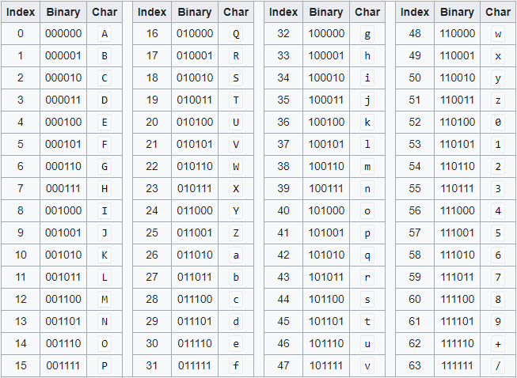
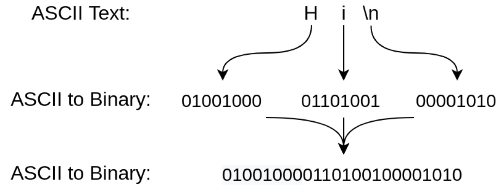
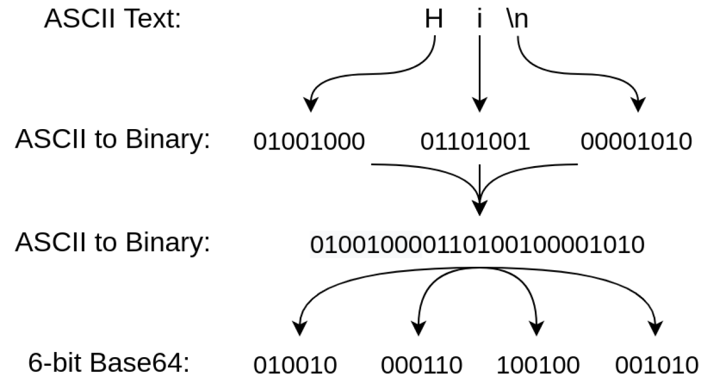
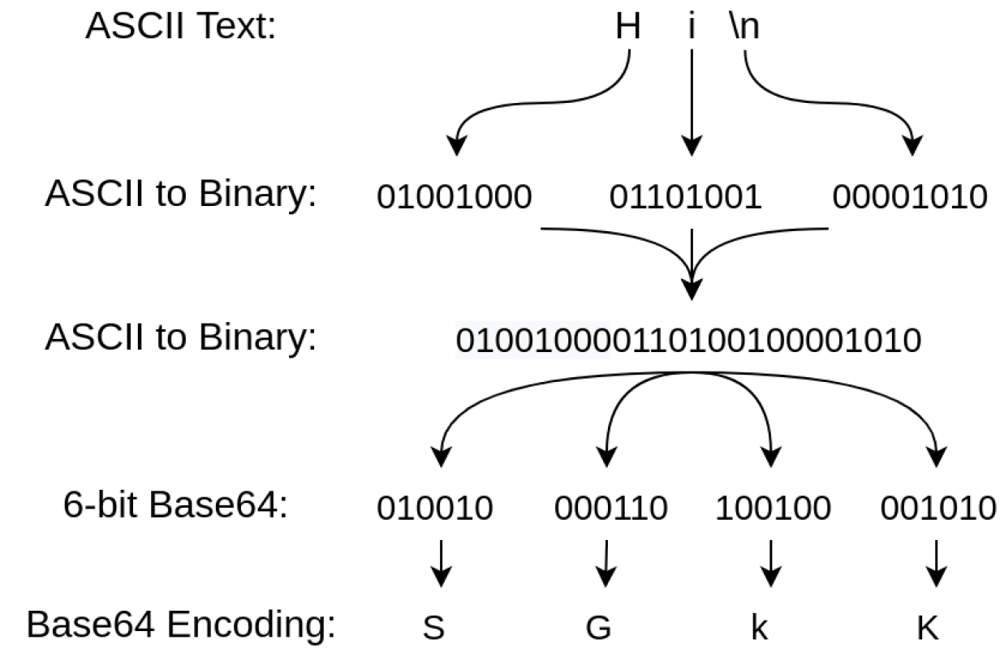
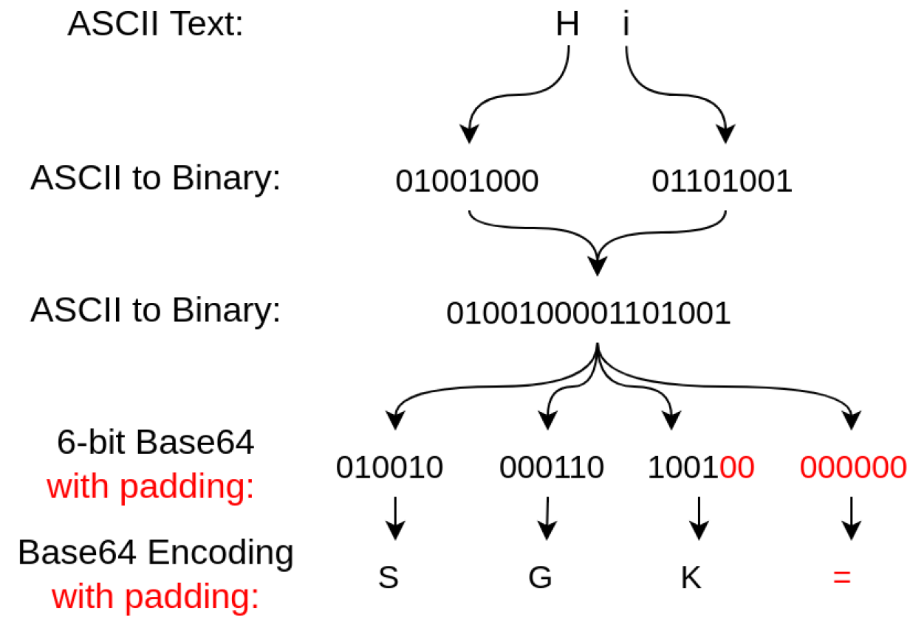

# Base
## Description
> What does this bDNhcm5fdGgzX3IwcDM1 mean? I think it has something to do with bases.

## Base64
**1. What is Base64?**

In computer programming, Base64 is a group of binary-to-text encoding schemes that represent binary data in sequences of 24 bits that can be represented by four **6-bit** Base64 digits.

Common to all binary-to-text encoding schemes, Base64 is designed to carry data stored in binary formats across channels that only reliably support text content. Base64 is particularly prevalent on the World Wide Web[1] where one of its uses is the ability to embed image files or other binary assets inside textual assets such as HTML and CSS files.[2]

(Reference: [Wikiped](https://en.wikipedia.org/wiki/Base64))

<br />

**2. Base64 Design**


<br />

**3. How Base64 Works**

Fundamentally, Base64 is used to encode binary data as printable text. The first step in the encoding process is to obtain the binary representation of each ASCII character.
<br />

ASCII uses 8 bits to represent individual characters, but Base64 uses 6 bits. Therefore, the binary needs to be broken up into 6-bit chunks.
<br />

Finally, these 6-bit values can be converted into the appropriate printable character by using a Base64 table.
<br />

Since Base64 uses 24-bit sequences, padding is needed when the original binary cannot be divided into a 24-bit sequence. You have probably seen this type of padding before represented by printed equal signs (=). For example, Hi without a newline is represented by only two 8-bit ASCII characters (for a total of 16 bits). Padding is removed by the Base64 encoding schema when data is decoded.
<br />

**4. Encode and decode Base64 at the command line**

Encode:
<br />`$ echo [encode_text] | base64`

Decode:
<br />`$ echo [decode_text] | base -d`

<br />

## Guideline
Decode text provided in description in the terminal

```
$ echo bDNhcm5fdGgzX3IwcDM1 | base64 -d
l3arn_th3_r0p35
```               

Therefore, the flag is `pico{l3arn_th3_r0p35}`