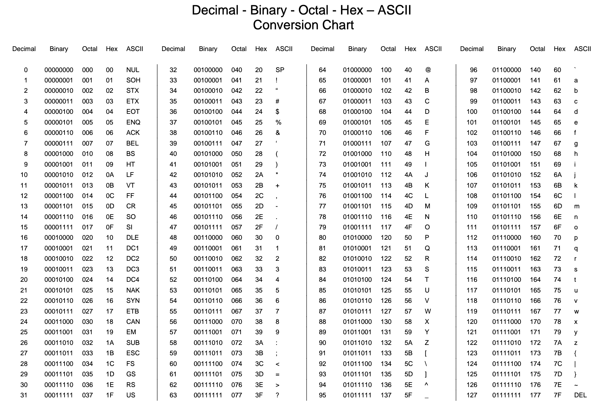

# Based
## Description
> To get truly 1337, you must understand different data encodings, such as hexadecimal or binary. Can you get the flag from this program to prove you are on the way to becoming 1337? Connect with nc jupiter.challenges.picoctf.org 15130.

<br />

## ASCII Table

To analyze the base of a string of encoded data, we have to be familar with the commonly used ASCII table
<br /> 

<br />

## Solution

Once connect with the provided port server, it will show you an example implying that player have to decode the data to get the flag
```
$ nc jupiter.challenges.picoctf.org 15130
Let us see how data is stored
colorado
Please give the 01100011 01101111 01101100 01101111 01110010 01100001 01100100 01101111 as a word.
...
you have 45 seconds.....

Input:
colorado
```

Then here is the second question whose base is either decimal or octal. But according to the ASCII printable characters, we can tell the data is in octal. So with the help of specific [decoder](http://www.unit-conversion.info/texttools/hexadecimal/#data), we can get the word
```
Please give me the  143 157 156 164 141 151 156 145 162 as a word.
Input:
container
```

The final one is obviously hex as characters appear in the data
```
Please give me the 736c75646765 as a word.
Input:
sludge
You've beaten the challenge
Flag: picoCTF{learning_about_converting_values_02167de8}
``` 

Therefore, we can get the flag `picoCTF{learning_about_converting_values_02167de8}`