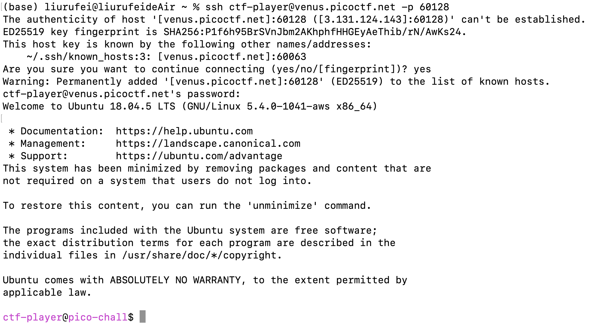
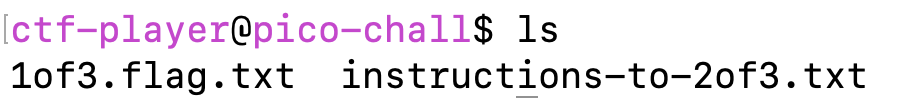
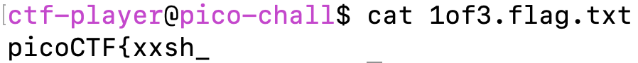
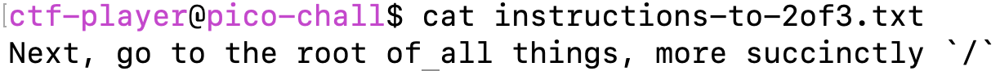
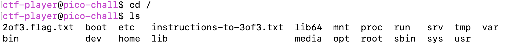
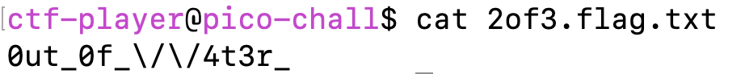
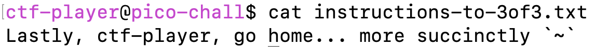
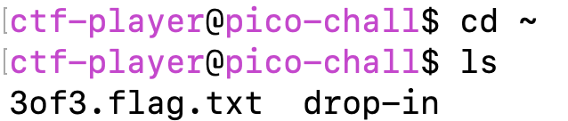
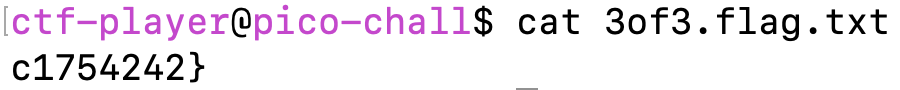
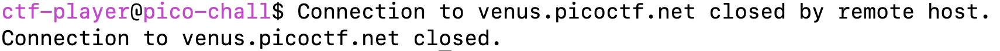

# Magikarp Ground Mission
### Description
>Do you know how to move between directories and read files in the shell? Start the container, `ssh` to it, and then `ls` once connected to begin. Login via `ssh` as `ctf-player` with the password, `b60940ca`

Before showing the specific steps to figure out the flag, there are several knowledge points need to be understood during the process

### Shell
1. What is Shell?
Before understanding shell, we have to get familiar with all the following terminologies: **Kernel, Shell, Terminal**

- Kernel
The kernel is a computer program that is the core of a computer’s operating system, with complete control over everything in the system.

- Shell
The shell is a special user program that provides an interface for the user to use operating system services. Shell accepts human-readable commands from users and converts them into something which the kernel can understand. It is a command language interpreter that executes commands read from input devices such as keyboards or from files. The shell gets started when the user logs in or starts the terminal.
> So if we are using any major operating system, we are **indirectly** interacting with the shell

Shell is broadly classified into two categories: Command Line Shell and Graphical shell

- Terminal
A program which is responsible for providing an interface to a user so that he/she can access the shell.

2. Basic Shell Command
2.1 Display the File Content
- <u>cat, less, more</u>
- <u>nano</u>: use text editor
- <u>head, tail</u>: print the first n / last (n-1) lines
2.2 File and Directory Manipulation 
- <u>mkdir</u>: create a directory 
- <u>rmdir</u>: delete a directory if it is empty
- <u>cp</u>: copy the files and directories from the source path to the destination path
- <u>mv</u>: move the files or directories
- <u>rm</u>: remove files or directories
- <u>touch</u>: create or update a file 
2.3 Extract, Sort and Filter Data
- <u>grep</u>: search for the specified text in a file
- <u>sort</u>: sort the contents of files
- <u>wc</u>: count the number of characters, words in a file
- <u>cut</u>: cut a specified part of a file
2.4 Basic Navigation Commands
- <u>ls</u>: list all the files or folders
- <u>ls -a</u>: list all files including the hidden files
- <u>cd</u>: change the directory
- <u>du</u>: show disk usage
- <u>pwd</u>: show the present working directory
- <u>man</u>: show all commands in Linux

For more details, please check:
\[Basic Shell Commands in Linux\]\(https://www.geeksforgeeks.org/basic-shell-commands-in-linux/\)
\[Unix and Shell commands\]\(https://afni.nimh.nih.gov/pub/dist/edu/data/CD.expanded/AFNI_data6/unix_tutorial/misc/unix_commands.html#u-mcc-amp\)

Unix and Shell commands: https://afni.nimh.nih.gov/pub/dist/edu/data/CD.expanded/AFNI_data6/unix_tutorial/misc/unix_commands.html#u-mcc-amp
Open a text file in Linux terminal: https://itslinuxfoss.com/do-i-open-text-file-linux-terminal/#:~:text=To%20open%20a%20text%20file%20in%20a%20Linux%20terminal%2C%20we,the%20content%20on%20the%20terminal.

3. Shell Script
Shell scripts or shell program are the files where we can write shell commands to avoid repetitive work. These files is saved with **'.sh'** extension.

### SSH
1. What is SSH?
SSH, also known as Secure Shell or Secure Socket Shell, is a network protocol that gives users a secure way to access a computer over an unsecured network. SSH also refers to the suite of utilities that implement the SSH protocol.

SSH service was created as a secure replacement for the unencrypted Telnet and uses cryptographic techniques to ensure that all communication to and from the remote server happens in an encrypted manner.
> There are three different encryption technologies used by SSH:
> 1. Symmetrical encryption
> 2. Asymmetrical encryption
> 3. Hashing

2. How does SSH work?
The SSH command consists of 3 distinct parts:
'ssh {user}@{host}'
'{user}': the account you want to access
'{host}': this can be IP address or a domain name

For more SSH commands, find them here: https://www.hostinger.com/tutorials/ssh/basic-ssh-commands

### Guideline
At the beginning, enter the command provided in the instance with terminal and log in with the provided password.
 

Continue to enter 'ls' once connected and there are 2 files turning up.

Open the '1of3.flag.txt' file with command 'cat', we will get the first part of flag.

Open the 'instructions-to-2of3.txt', we get the instruction to the next part.

Follow the instruction, we go to the root and can list all file in that directory.

Open the '2of3.flag.txt', we will get the second part of flag.

Open the 'instructions-to-3of3.txt', we get the instruction to the next part.

Follow the instruction, we go to the home and can list all file in that directory.

Now we open the '3of3.flag.txt' to get the final part of flag. (Hooray!)
 

Finally, assemble selected parts in order to the complete flag, that is 'picoCTF{xxsh_0ut_0f_\/\/4t3r_c1754242}'. Type it in the answer box, the connection will terminate automatically and you capture the flag successfully!

